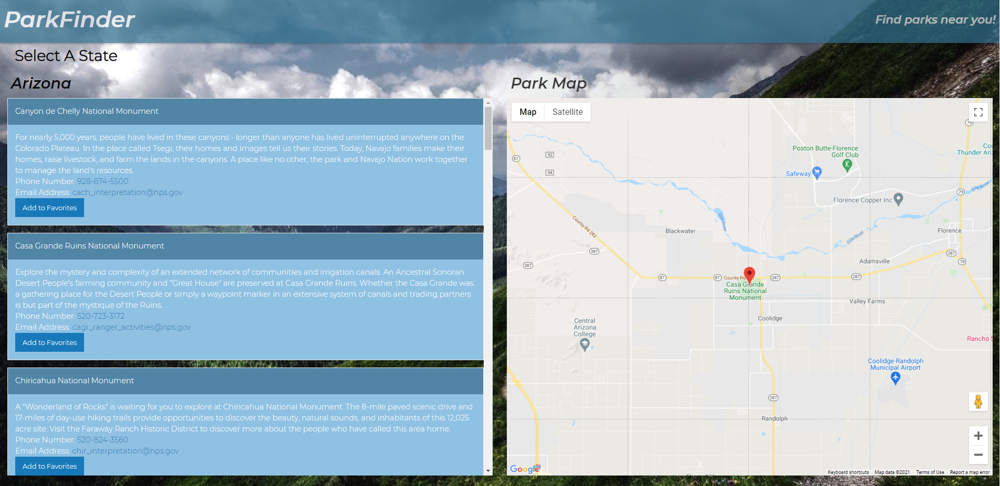

# Park Finder

## Description
A site where you can pull up state parks, organized by state. Then, after selecting a park, you can map it out!

## Usage
1. Hover over "Select a State"
2. Select which state you wish to see parks for
3. Once selected, you are presented with a list of parks.
4. Click on any park, and a map will generate.

- To add to favorites, click the "Add to Favorites" button on the park's card
- To load favorites, select Favorites from the Selection dropdown

## Authors
- Elliott Kvamme
- Ian Miller
- Adam Tilly
- Mike Horvath
- Carrington Adams
- Tony Busch

## Contact
See my GitHub page [here](https://github.com/Bycicleace)

## Live Site
URL: [Park Finder](https://Bycicleace.github.io/ParkFinder/)

