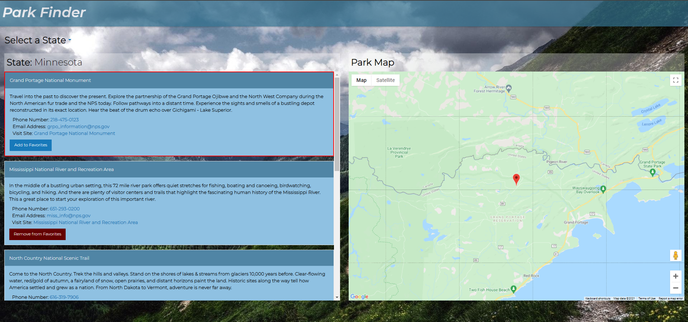

# Park Finder

## Description
A site where you can pull up state parks, organized by state. Then, after selecting a park, you can map it out, and keep a favorites list.

This project utilizes two APIs. The first is the National Park Service (NPS) API to get park information. The second is the Google Maps API to plot the parks on a map.

Additionally, this uses the Foundation CSS Framework.

## Usage
- To load a State's parks:
    1. Hover over "Select a State"
    2. Find and click on the state you wish.
    3. That states parks will be listed on the left, with the top selected and mapped out on the right.

- To map out a park:
    1. Locate the park you wish to map out
    2. Click anywhere on that park's card.
    3. A red border is displayed on the park's card indicating selection and the map is updated to show the park's location.

- To add a park to your favorites list:
    1. Find the desired park.
    2. Click on the "Add to Favorites" button on that park's card.

- To remove a park from your favorites list:
    1. Locate the favorited park by state, or by your favorites list.
    2. Click on the "Remove from Favorites" button on that card.

- To view your favorites:
    1. Hover over "Select a State"
    2. Select the "Favorites" option
    3. Your favorited parks are displayed.

## Authors
- Elliott Kvamme
- Ian Miller
- Adam Tilly
- Mike Horvath
- Carrington Adams
- Tony Busch

## Contact
See my GitHub page [here](https://github.com/Bycicleace)

## Live Site
URL: [Park Finder](https://Bycicleace.github.io/ParkFinder/)

